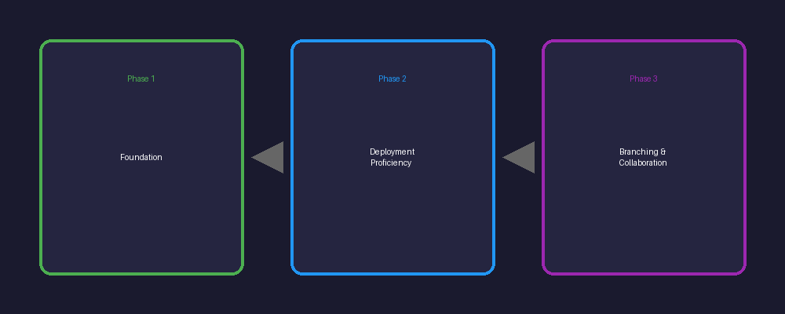
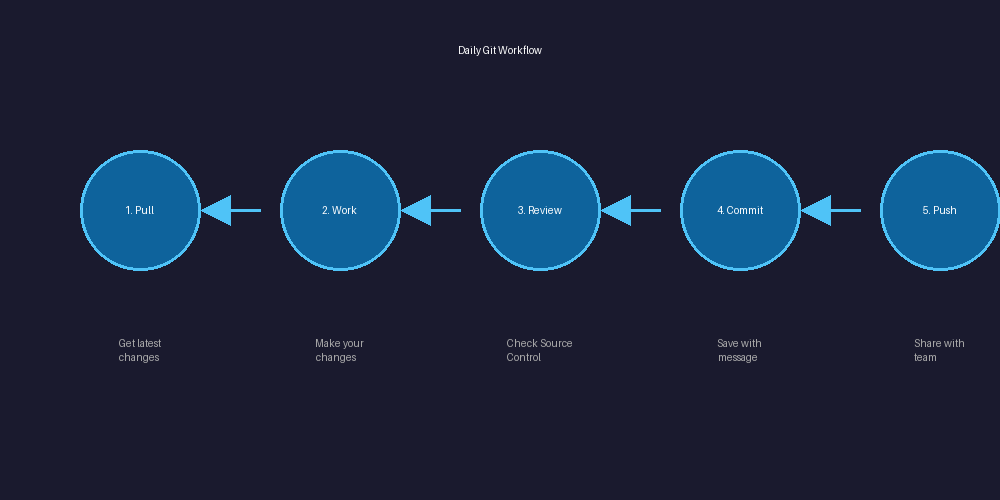
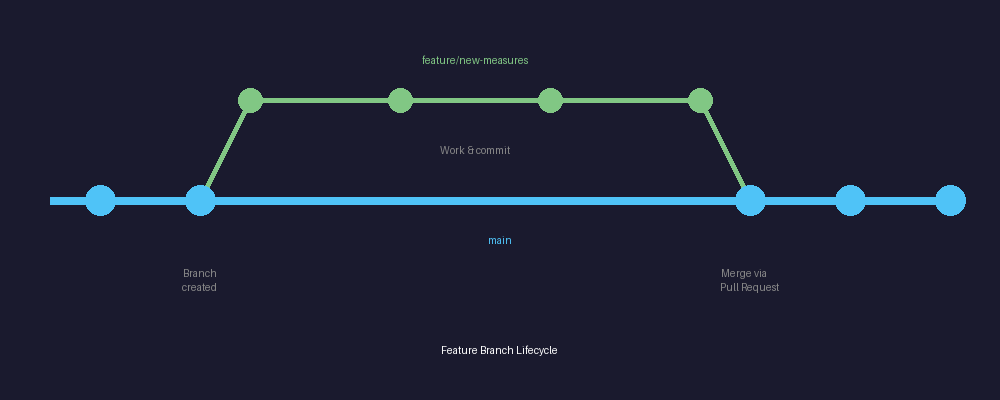

This training plan supports your phased rollout of Git-integrated Fabric workspaces. Each phase builds on the previous, allowing BI Engineers to develop confidence before adding complexity.

**Audience:** BI Engineers with Power BI/Fabric experience but limited or no Git background

**Prerequisites:** Access to Azure DevOps, Fabric workspace contributor rights

---

## Phase 1: Foundation — Main Branch & Basic Sync

**Goal:** Engineers can commit changes from Development workspace to Git and understand the sync relationship.

### Training Module 1.1: Git Fundamentals for BI Professionals

*Duration: 2 hours — Conceptual training, no hands-on coding required yet*

#### Topics to Cover

**What is version control and why it matters for BI work:**

- **Track who changed what and when** — No more detective work wondering who modified that measure
- **Safely experiment without breaking production** — Try new approaches with a safety net
- **Enable collaboration without overwriting each other's work** — Multiple developers, one source of truth

**The "snapshot" mental model:**

- Each commit captures the entire state of your workspace items
- Git efficiently stores only what changed, but you can restore any full snapshot
- Contrast with "save as v1, v2, v3" file naming chaos

**Core vocabulary (keep it simple):**

| Term | Definition |
|------|------------|
| **Repository (repo)** | The container for all your workspace items and their history |
| **Commit** | A saved snapshot with a message describing what changed |
| **Branch** | A parallel line of development (Phase 1 uses only "main") |
| **Sync** | Bidirectional—push your changes up, pull others' changes down |

**What gets stored in Git vs. what doesn't:**

<h4 style="color: #4caf50; margin-top: 0;">✅ Stored in Git</h4>

- Semantic models
- Reports
- Notebooks
- Data pipelines
- Dataflows

<h4 style="color: #e53935; margin-top: 0;">❌ Not Stored</h4>

- Data itself
- Refresh schedules
- Workspace settings
- Connection credentials

**Delivery Method:** Instructor-led session with visual diagrams. Avoid command-line examples—focus on concepts.

**Assessment:** Short quiz on terminology and concepts.

---

### Training Module 1.2: Azure DevOps Navigation

*Duration: 1 hour*

Engineers need basic familiarity with where their work lives in Azure DevOps.

#### Topics to Cover

- Logging into Azure DevOps and finding your project/repo
- Viewing commit history — Who made changes and when
- Reading commit messages
- Viewing what changed in a commit (the "diff")
- Understanding the repo structure — How Fabric items appear as folders/files

#### Hands-On Exercise

1. Navigate to your team's repo
2. Find a recent commit and identify: who made it, when, what changed
3. Locate a specific semantic model or report in the repo file structure

**Delivery Method:** Screen-share walkthrough followed by guided exploration.

---

### Training Module 1.3: Fabric Git Integration — Connecting & Committing

*Duration: 2 hours — This is the critical hands-on session for Phase 1*

#### Topics to Cover

**Connecting a workspace to a Git repo (demo by admin, engineers observe):**
- This is typically a one-time setup by leads/admins
- Engineers understand the connection exists but won't configure it themselves

**The Source Control panel in Fabric:**
- Where to find it
- Understanding the status indicators:
  - ✅ **Synced** — Your workspace matches Git
  - 📝 **Changes pending** — You have uncommitted work
  - ⬇️ **Update required** — Others have committed changes
  - ⚠️ **Conflicts** — You and someone else changed the same item

**Committing your changes:**
- When to commit (logical units of work, not every tiny edit)
- Selecting which items to include in a commit

**Writing good commit messages:**

| ❌ Bad | ✅ Good |
|--------|---------|
| "updates" | "Add YTD calculation to Sales semantic model" |
| "fixed stuff" | "Fix incorrect date filter on Regional Report" |
| "changes" | "Update customer dimension with new geography columns" |

**Pulling changes from Git (Sync/Update):**
- When others have committed, you need to pull before you can push
- Understanding the "update required" status
- Handling the "your workspace has changes AND the repo has changes" scenario:
  1. Commit your work first
  2. Then update

#### Hands-On Exercise (in a sandbox/training workspace)

1. Make a small change to a report or semantic model
2. Open Source Control, review what changed
3. Write a descriptive commit message and commit
4. Have a partner make and commit a different change
5. Pull/sync to receive your partner's changes

**Delivery Method:** Instructor-led with immediate hands-on practice. Pair engineers up.

---

### Training Module 1.4: Understanding Deployment Pipelines

*Duration: 1.5 hours — In Phase 1, engineers primarily observe the pipeline; the Release Manager operates it*

#### Topics to Cover

**The three-environment model:** Development → Test → Production
- Why we separate them (protect production, enable testing)
- What "deploy" means (copying workspace items between environments)

**Fabric Deployment Pipelines overview:**
- Visual walkthrough of the pipeline interface
- Understanding deployment status indicators
- What gets deployed vs. what's environment-specific

**The Release Manager role:**
- Who triggers deployments and when
- The approval process at merge time

**Engineer responsibilities in Phase 1:**
- Make changes only in Development workspace
- Commit changes to Git with clear messages
- Communicate with Release Manager when features are ready

**Delivery Method:** Demo/walkthrough by Release Manager or Admin. Q&A focused.

---

### Phase 1 Reinforcement Activities

**Weekly for first month:**
- 15-minute "Git check-in" during team standup
- Engineers share: one commit they made, one thing they learned or found confusing

**Documentation to Provide:**
- One-page quick reference: "How to Commit Your Changes"
- Commit message guidelines with examples relevant to BI work
- Who to contact when something goes wrong

**Success Metrics:**
- ✅ All engineers have made at least 5 commits independently
- ✅ Commit messages are descriptive (spot-check by leads)
- ✅ No incidents of lost work due to sync issues

---

## Phase 2: Deployment Pipeline Proficiency

**Goal:** Engineers understand the full deployment lifecycle and can participate in release planning. Release Manager handles execution.

### Training Module 2.1: Deep Dive on Deployment Pipelines

*Duration: 2 hours*

#### Topics to Cover

**Detailed pipeline mechanics:**
- Comparing items across stages (what's different between Dev and Test?)
- Understanding "newer in source" vs. "newer in target" indicators
- Selective deployment (deploying specific items, not everything)

**Deployment rules and parameters:**
- Environment-specific connection strings
- Parameter rules (how the same model connects to different data sources per environment)
- Why Test might point to a copy of production data

**Deployment history and rollback concepts:**
- Viewing what was deployed when
- If something breaks in Test, how do we recover?

**Common deployment scenarios:**
- Deploying a new report (exists in Dev, doesn't exist in Test yet)
- Deploying updates to an existing semantic model
- What happens to user-created content in downstream workspaces

#### Hands-On Exercise

- Walk through a staged deployment with the Release Manager
- Engineers observe and ask questions
- Review deployment history after completion

---

### Training Module 2.2: Environment-Aware Development

*Duration: 1.5 hours*

#### Topics to Cover

**Designing for deployment:**
- Using parameters instead of hardcoded values
- Understanding what will and won't transfer cleanly

**Testing responsibilities:**
- When your work reaches Test, who validates it?
- Communicating with business users about Test environment access

**The feedback loop:**
- Issues found in Test → fixes made in Dev → redeploy
- Documenting what was tested and approved

**Production considerations:**
- Refresh schedules in Production
- Impact on existing reports and dashboards
- Communicating releases to end users

#### Discussion Exercise

Walk through a real example: "We need to add three new measures to the Sales model and update two reports. Map out the journey from development to production."

---

### Phase 2 Reinforcement Activities

**Bi-weekly:**
- Engineers participate in deployment planning meetings
- Review of any deployment issues and lessons learned

**Documentation to Provide:**
- Environment comparison chart (what's different in Dev/Test/Prod)
- Checklist: "Is my feature ready for deployment?"
- Parameter and connection rule reference

**Success Metrics:**
- ✅ Engineers can explain the deployment path for their changes
- ✅ Reduction in deployment failures due to environment-specific issues
- ✅ Engineers proactively flag deployment considerations during development

---

## Phase 3: Branching & Collaborative Development

**Goal:** Engineers work in isolated feature branches and workspaces, submitting changes via pull requests.

### Training Module 3.1: Branching Concepts

*Duration: 2 hours — This is a significant conceptual leap—take time here*

#### Topics to Cover

**Why branches?**
- Multiple engineers working simultaneously without conflicts
- Isolate experimental or risky changes
- Enable review before changes reach Main

**Branch mental model:**
- **Main branch** = the "blessed" version that syncs to Dev workspace
- **Feature branch** = your personal copy to work in
- Branches share history until they diverge

**The feature branch lifecycle:**

1. Create branch from Main
2. Work in your Feature Workspace (synced to your branch)
3. Commit changes to your branch
4. When ready, request to merge back to Main
5. After merge, your branch can be deleted

**Visualizing branches:**
- Show Azure DevOps branch visualization
- Trace a feature from branch creation through merge

#### Hands-On Exercise

- View existing branches in Azure DevOps
- Look at the commit history and identify where branches diverged
- Trace a completed feature branch from creation to merge

**Delivery Method:** Heavy use of diagrams and visualization. This is abstract—make it concrete.

---

### Training Module 3.2: Working with Feature Workspaces

*Duration: 2.5 hours*

#### Topics to Cover

**Feature Workspace setup:**
- How your feature branch connects to a dedicated workspace
- Naming conventions (e.g., "Feature-SalesReporting-JSmith")
- Who creates these? (Likely leads/admins initially)

**Daily workflow in a feature workspace:**
- This is now your sandbox—experiment freely
- Commit regularly (even work-in-progress is okay on a feature branch)
- Keep your branch updated with changes from Main

**When you're ready to merge:**
- Final testing in your feature workspace
- Clean up any experimental commits if needed
- Notify the team/Release Manager

**After the merge:**
- Your Feature Workspace may be deleted or recycled
- Your changes appear in the Dev workspace (synced to Main)
- Normal deployment pipeline takes over from there

#### Hands-On Exercise (in training environment)

1. Receive access to a feature workspace connected to a feature branch
2. Make a series of changes, committing as you go
3. Review your commit history in Azure DevOps

---

### Training Module 3.3: Pull Requests & Code Review

*Duration: 2 hours*

#### Topics to Cover

**What is a Pull Request (PR)?**
- A formal request to merge your branch into Main
- Includes all your commits and a summary of changes
- Opportunity for review before integration

**Creating a Pull Request in Azure DevOps:**
- Selecting source (your feature branch) and target (Main)
- Writing a good PR description:
  - What does this change accomplish?
  - Any special testing needed?
  - Related work items or requirements

**The review process:**
- Who reviews? (Leads, peers, Release Manager)
- What reviewers look for:
  - Does it meet requirements?
  - Any obvious errors or issues?
  - Naming conventions, documentation
- Responding to feedback and making updates

**Completing the merge:**
- Approval requirements (your org's policy)
- The merge itself (often done by Release Manager)
- Deleting the feature branch after merge

#### Hands-On Exercise

1. Create a Pull Request for the work done in Module 3.2
2. Practice reviewing a partner's PR and leaving comments
3. Respond to comments on your own PR
4. (Admin completes the merge in training environment)

---

### Training Module 3.4: Handling Sync and Merge Conflicts

*Duration: 1.5 hours — Conflicts are rare in BI artifacts but engineers should know what to do*

#### Topics to Cover

**Why conflicts happen:**
- Two people changed the same item in different branches
- When branches are merged, Git can't automatically reconcile

**Preventing conflicts:**
- Communicate with teammates about who's working on what
- Keep feature branches short-lived
- Pull updates from Main regularly

**When conflicts occur:**
- Recognizing conflict indicators in Fabric and Azure DevOps
- General approaches: who has the "right" version?
- When to escalate to leads/admins

**Practical resolution:**
- For most BI artifacts, this may mean choosing one version
- In some cases, manual re-creation of combined changes
- Documentation: what was the conflict, how was it resolved?

#### Discussion Exercise

"You and a colleague both modified the Sales semantic model in separate feature branches. A conflict is detected when you try to merge. Walk through how you would handle this."

---

### Phase 3 Reinforcement Activities

**Ongoing:**
- Peer PR reviews (engineers review each other's work)
- Monthly retrospective: what's working, what's confusing about the branching workflow

**Documentation to Provide:**
- Feature branch workflow diagram
- PR template with prompts for good descriptions
- Conflict escalation process

**Success Metrics:**
- ✅ Engineers independently create and work in feature branches
- ✅ PRs include clear descriptions and pass review efficiently
- ✅ Conflicts are rare and handled without major disruption

---

## Supporting Resources Across All Phases

### Quick Reference Cards (one page each)

1. Git vocabulary cheat sheet
2. How to commit (with screenshots)
3. Commit message examples for BI work
4. Feature branch workflow checklist
5. PR creation guide

### Office Hours

- Weekly drop-in session (30 min) for questions
- Particularly important in first month of each phase

### Champions/Mentors

- Identify 1-2 engineers who pick it up quickly
- They become first-line support for peers
- Reduces bottleneck on leads/admins

### Sandbox Environment

- Maintain a training workspace/repo
- Engineers can experiment without fear
- Use for all hands-on exercises

---

## Suggested Timeline

| Phase | Duration | Key Milestone |
|-------|----------|---------------|
| Phase 1 | 4-6 weeks | All engineers committing independently to Main |
| Phase 2 | 3-4 weeks | Engineers participate in deployment planning |
| Phase 3 | 6-8 weeks | Engineers using feature branches and PRs for all work |

**Total estimated training time per engineer:**
- Phase 1: ~6.5 hours instruction + practice
- Phase 2: ~3.5 hours instruction + practice
- Phase 3: ~8 hours instruction + practice

> **Pro Tip:** Allow 2-4 weeks between phases for skills to solidify before introducing new concepts.

---

## Common Pitfalls to Address Proactively

### 1. "I'll just commit everything at the end"

- Leads to massive, hard-to-review commits
- Risk of losing work if something goes wrong
- **Solution:** Encourage small, frequent commits with clear messages

### 2. Fear of "breaking" Git

- Reassure: Git is very hard to truly break
- Everything is recoverable (that's the point!)
- **Solution:** Encourage experimentation in sandbox

### 3. Forgetting to pull before starting work

- Build habit: first thing each day, sync/update
- **Solution:** Reduces conflicts and ensures you have latest changes

### 4. Vague communication about what's ready

- Establish clear signals: "committed" ≠ "ready for deployment"
- **Solution:** Use work item states or explicit communication

### 5. Long-lived feature branches

- Branches open for weeks accumulate conflicts
- **Solution:** Encourage smaller, incremental features; merge frequently to Main

---

## Conclusion

This phased approach lets your BI Engineers build confidence incrementally:

- **Phase 1** establishes the foundation of version control thinking
- **Phase 2** connects their work to the broader release process
- **Phase 3** enables true parallel development with professional software practices

The key is patience—these concepts are second nature to software developers but genuinely new to many BI professionals. Invest in the fundamentals, provide safe spaces to practice, and celebrate early wins.

---

## Resources

- [Microsoft Fabric Git Integration Documentation](https://learn.microsoft.com/fabric/cicd/git-integration/intro-to-git-integration)
- [Azure DevOps Repos Documentation](https://learn.microsoft.com/azure/devops/repos/)
- [Fabric Deployment Pipelines](https://learn.microsoft.com/fabric/cicd/deployment-pipelines/intro-to-deployment-pipelines)
- [Training.tips](https://training.tips) — For hands-on Power BI and Fabric training
